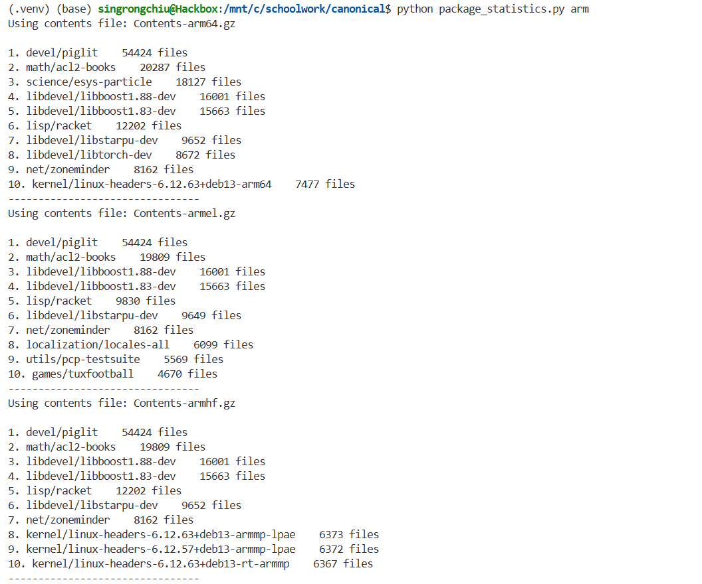
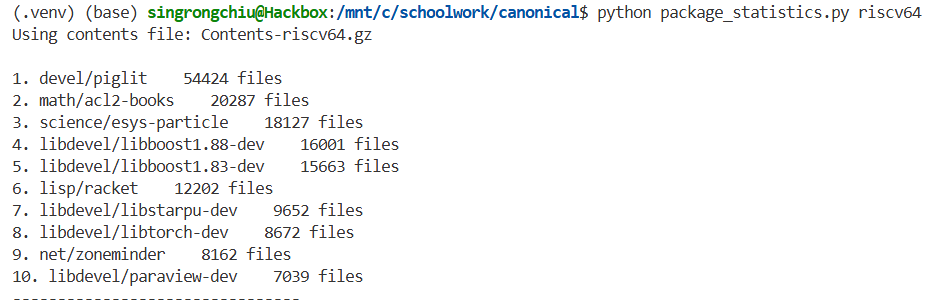

# package_statistics.py 
To see changes through time: <https://github.com/singrongchiu/packagestats>.
package_statistics.py takes an architecture as the first argument, and outputs information about the Contents-xx.gz files associated with it. Specifically, it will write the top 10 packages with the most number of files associated with them. 
### IMPORTANT: Ensure that python version 3.14 is installed and available. Python versions below 3.14 do not have the heapify_max function natively 

#### To set up:
```
cd packagestats
source start.sh
```

#### To run: 
(architecture can be arm64; it can also be arm, which will output results for architectures with "arm" in the name like arm64, armel, armhf)
```
python package_statistics.py [architecture]
# OR
./package_statistics.py [architecture]
```

#### Implementation details:
1. Run a get on the static url: <http://ftp.uk.debian.org/debian/dists/stable/main/>
2. Find all the hyperlinks associated with architecture by parsing all hyperlink tags. They have to match Contents.xxx[architecture]xxx.gz and not include "udeb"
3. For each of the hyperlinks run a get on the hyperlink url
4. Instead of downloading contents of the get into a file and reading it, the script gets the response content, directly unzips it, and the output is stored in a string variable
5. Add to a hashmap with packages as the key and the number of files as the value. If there are multiple packages (separated by comma), the script will add 1 to all 3 packages in the hashmap. 
6. Create a max heap in O(logn) time and pop the top 10 entries in the heap

#### Example output


